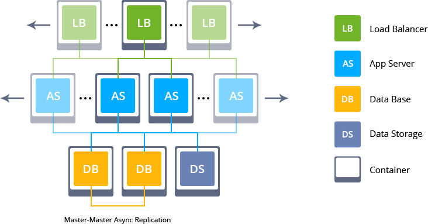
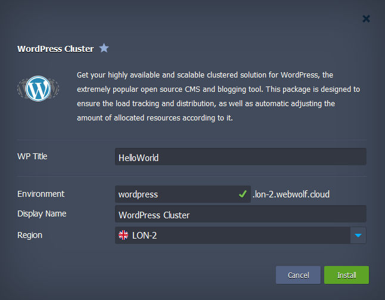
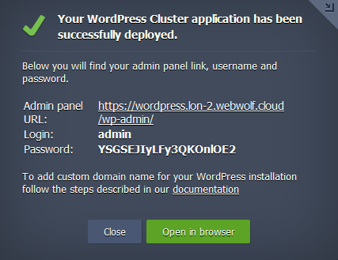

# Highly Available and Auto-Scalable WordPress Cluster

Out-of-the-box automated WordPress Cluster solution for large businesses and mission-critical sites.
This automated package includes the very popular Avada Theme for WordPress.

## WordPress Cluster Topology

Upon the package installation, a new environment with the following topology will be created:
* **NGINX** load balancers are used for distributing the incoming traffic within a cluster
* the WordPress application itself is handled by **NGINX PHP** servers with preconfigured [automatic horizontal scaling](https://docs.jelastic.com/automatic-horizontal-scaling) to handle load spikes
* Highly-available **[MySQL DB Cluster](https://github.com/jelastic-jps/mysql-cluster)** is used to store and operate user data
* **[Data Storage](https://docs.jelastic.com/data-storage-container)** is mounted to all application server nodes for sharing common data

## Deployment to WebWolf Hosting

Click the **Deploy** button below, specify your email address within the widget,

[WebWolf Hosting](https://webwolfhosting.com/install-application/?manifest=https://raw.githubusercontent.com/webwolfhosting/avada-wp-cluster/master/manifest.jps&keys=app.cloud.webwolf.systems&filter=auto_cluster) and press **Install**.

> **Note:** If you are already registered at WebWolf Hosting, you can deploy this cluster by importing the  [the package manifest raw link](https://raw.githubusercontent.com/webwolfhosting/avada-wp-cluster/master/manifest.jps) from within your dashboard.

## Installation Process

In the opened confirmation window of your WebWolf Hosting Dashboard, type the preferable **WP Title** for your blog site. Also, set an _Environment_ name and, optionally, customize its _[Display Name](https://docs.jelastic.com/environment-aliases)_. Then, select the preferable _[region](https://docs.jelastic.com/environment-regions)_ (if several are available) and click on **Install**.

Once the deployment is finished, you'll see the appropriate success pop-up with access credentials to your administration WordPress panel, whilst the same information will be duplicated to your email box.

So now you can just click on the **Open in browser** button within the shown frame and start filling your highly available and reliable WP installation packaged with Avada ready to use.

